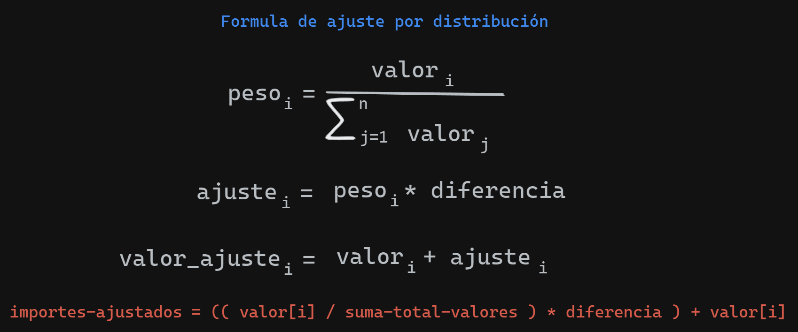
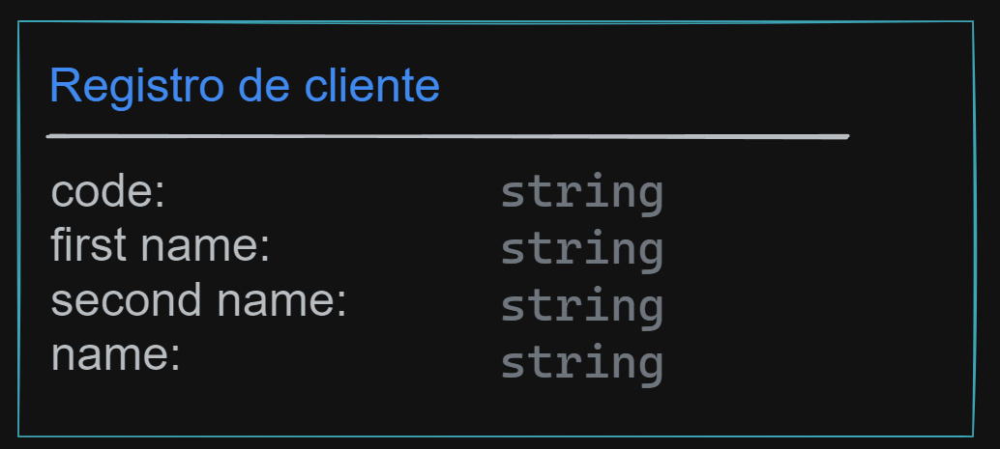
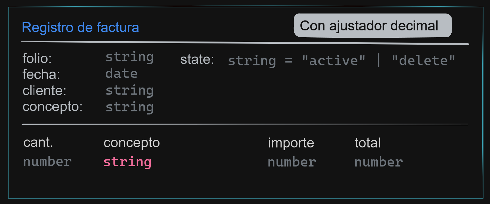
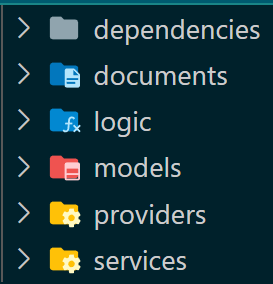

# Aplicación de conocimientos

## Formula

<p align="center">
  <a href="#" target="blank"></a>
</p>

## Cliente

<p align="center">
  <a href="#" target="blank"></a>
</p>

- Operaciones

  - create
  - update
  - getByCode

- Validación

  - Que no exista código repetido

- Observaciones
  - Id autogenerada
  - código único en base de datos

### Create

```sql
  const input = {
    register: client,
  }

  -- Instrucción SQL
  SELECT providers.client_create($1);

  -- Retorno: Array de objeto de tipo client
```

### Update

```sql

  const id = client.id

  const input = {
    register: client,
  }

  -- Instrucción SQL
  SELECT providers.client_update($1, $2);

  -- Retorno: Array de objeto de tipo client
```

### GetByCode

```sql

  const code = client.code

  -- Instrucción SQL
  SELECT * from providers.client_get_by_code($1);

  -- Retorno: Array objeto de tipo client
```

## Factura

<p align="center">
  <a href="#" target="blank"></a>
</p>

- Operaciones

  - create
  - update
  - getById
  - getAll
  - updateStateByID

- Validaciones

  - Validar que el folio no exista
  - El registro de la factura debe cuadrar con el total de la factura impresa (simulación) es decir debe recibir como parámetro el total impreso.
  - Solo puede existir diferencia a nivel de decimales.

- Observaciones
  - Aplicar la estrategia de ajuste de decimales solo si existe diferencia
  - getAll se debe especificar que estado de los datos requiero (all, active, delete)

### Create

```sql
  const input = {
    register: invoice,
  }

  -- Instrucción SQL
  SELECT providers.invoice_create($1);

  -- Retorno: Array objeto de tipo  invoice
```

### Update

```sql

  const id = invoice.id

  const input = {
    register: invoice
  }

  -- Instrucción SQL
  SELECT providers.invoice_update($1, $2);

  -- Retorno: Array objeto de tipo invoice
```

### GetById

```sql

  const id = invoice.id

  -- Instrucción SQL
  SELECT * from providers.invoice_get_by_id($1);

  -- Retorno: Array objeto de tipo invoice
```

### GetByAll

```sql

  const state = "all" | "active" | "delete"

  -- Instrucción SQL
  SELECT * from providers.invoice_get_by_all($1);

  -- Retorno: Array objeto de tipo invoice
```

### UpdateStateById

```sql

  const id = invoice.id
  const state = "all" | "active" | "delete"

  -- Instrucción SQL
  SELECT providers.invoice_update_state_by_id($1, $2);

  -- Retorno: Array objeto de tipo invoice
```

## Arquitectura

<p align="center">
  <a href="#" target="blank"></a>
</p>

## Planificación

- Aplicar principios SOLID

- Se debe aplicar arquitectura

- Aplicar los test unitarios correspondientes
  - system/tools/...
  - modules/cliente/...
  - modules/factura/...

## Clonación

[Repositorio - https://github.com/gposoft/dev-invoice](https://github.com/gposoft/dev-invoice)

```bash
  git clone https://github.com/gposoft/dev-invoice.git

  # entrar a la carpeta
  cd dev-invoice

  #Crear la rama

  #Developer 1
  git checkout -b feature/dev-1-practice

  #Developer 2
  git checkout -b feature/dev-2-practice
```

## Upload changes

```bash

  git add .
  git commit -m "mensaje del commit"
  git push origin feature/dev-1-practice

```

Para poder correr el proyecto se debe hacer primero la instalación de los paquetes

```bash
  npm install
```
