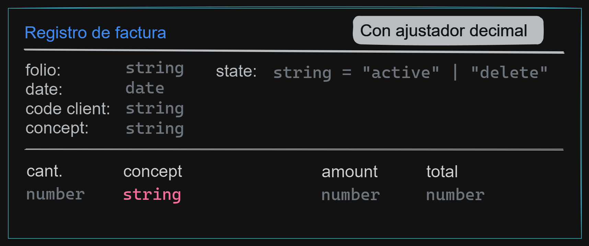

# Aplicación de conocimientos

## Formula

  

## Cliente

  

## Factura

  

## Arquitectura

  

## Planificación

- Aplicar principios SOLID 

- Aplicar estrategia para implementar solución de cuadre de decimales  
  - Debe enviar error si hay diferencia en la parte entera del total
  - Aplicar la estrategia de ajuste de decimales solo si existe diferencia 

- El registro de la factura debe cuadrar con el total de la factura impresa (simulación) es decir debe recibir como parámetro el total también

- Se debe aplicar arquitectura

- Aplicar los test unitarios correspondientes
  - system/tools/...
  - modules/cliente/...
  - modules/factura/...
